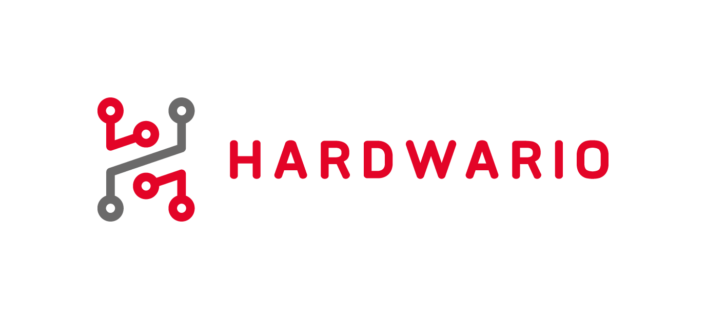

# HARDWARIO Google Assistant Node-RED

> Enables you to control the multifunctional industrial HARDWARIO IoT Kits with Google Assistant

[![NPM Version][npm-image]][npm-url]
[![Downloads Stats][npm-downloads]][npm-url]
[![Build][travis]][travis-url]



## Installation

OS X & Linux & Windows

```sh
npm install @hardwario/node-red-contrib-hardwario-voice --save
```

## Usage example

Paste this flow into the Node-RED:

```json
[
  {
    "id": "90a4c19d.773d5",
    "type": "mqtt out",
    "z": "f12ddf57.809",
    "name": "",
    "topic": "",
    "qos": "",
    "retain": "",
    "broker": "a5605d5c.f080e",
    "x": 702.000020980835,
    "y": 767.0000238418579,
    "wires": []
  },
  {
    "id": "8326e88f.cf6338",
    "type": "mqtt in",
    "z": "f12ddf57.809",
    "name": "",
    "topic": "#",
    "qos": "2",
    "broker": "9f1d47fd.82cff8",
    "x": 251.00000381469727,
    "y": 768.0000228881836,
    "wires": [["d9d67844.d6f638", "77456e04.0fb01"]]
  },
  {
    "id": "77456e04.0fb01",
    "type": "hardwario-voice",
    "z": "f12ddf57.809",
    "name": "",
    "cred": "",
    "x": 475.16668701171875,
    "y": 767.3333129882812,
    "wires": [["90a4c19d.773d5"]]
  },
  {
    "id": "a5605d5c.f080e",
    "type": "mqtt-broker",
    "z": "",
    "broker": "localhost",
    "port": "1883",
    "clientid": "",
    "usetls": false,
    "compatmode": true,
    "keepalive": "60",
    "cleansession": true,
    "willTopic": "",
    "willQos": "0",
    "willPayload": "",
    "birthTopic": "",
    "birthQos": "0",
    "birthPayload": ""
  },
  {
    "id": "9f1d47fd.82cff8",
    "type": "mqtt-broker",
    "z": "",
    "broker": "localhost",
    "port": "1883",
    "clientid": "",
    "usetls": false,
    "compatmode": true,
    "keepalive": "60",
    "cleansession": true,
    "willTopic": "",
    "willQos": "0",
    "willPayload": "",
    "birthTopic": "",
    "birthQos": "0",
    "birthPayload": ""
  }
]
```

_For more examples and usage, please refer to the [Docs][wiki]._

## Meta

Distributed under the MIT license. See `LICENSE` for more information.

---

Made with &#x2764;&nbsp; by [**HARDWARIO a.s.**](https://www.hardwario.com/) in the heart of Europe.

<!-- Markdown link & img dfn's -->

[npm-image]: https://img.shields.io/npm/v/@hardwario/node-red-contrib-hardwario-voice.svg?style=flat-square
[npm-url]: https://www.npmjs.com/package/@hardwario/node-red-contrib-hardwario-voice
[npm-downloads]: https://img.shields.io/npm/dm/@hardwario/node-red-contrib-hardwario-voice.svg?style=flat-square
[wiki]: https://developers.hardwario.com/integrations/google-assistant
[travis]: https://travis-ci.org/hardwario/node-red-contrib-hardwario-voice.svg?branch=master
[travis-url]: https://travis-ci.org/hardwario/node-red-contrib-hardwario-voice?utm_medium=notification&utm_source=github_status
